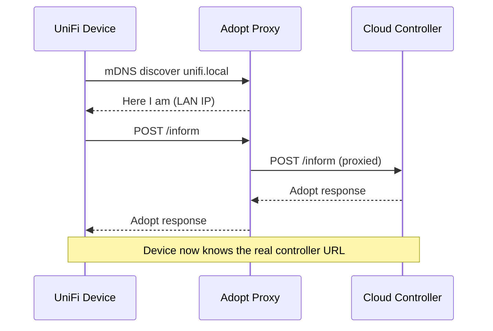

# UniFi Adopt Proxy

Adopt UniFi devices to a cloud-hosted controller when you can't control DHCP options or local DNS. Run it standalone via Docker or as a Home Assistant add-on.

## The problem

UniFi devices (Flex Mini, APs, etc.) discover their controller via mDNS (`unifi.local`) or DHCP Option 43. If your controller is in the cloud and you don't control DHCP or DNS on the local network, devices sit in an adoption loop forever.

## The solution

This container advertises `unifi.local` on your LAN via mDNS and proxies the `/inform` endpoint to your cloud controller. The device discovers it, adopts through the proxy, and the controller pushes its real inform URL to the device. Remove the proxy after adoption.



## Installation

### Home Assistant Add-on

1. In Home Assistant, go to **Settings > Add-ons > Add-on Store**
2. Click the **⋮** menu (top right) > **Repositories**
3. Add this URL:
   ```
   https://github.com/rsnodgrass/unifi-adopt-proxy
   ```
4. Click **Add**, then close the dialog
5. Find **UniFi Adopt Proxy** in the store and click **Install**
6. Go to the **Configuration** tab and set your controller URL:
   ```
   https://your-controller-ip:8443
   ```
7. Click **Start**
8. Check the **Log** tab to confirm it's running:
   ```
   Proxying :8080/inform -> https://your-controller-ip:8443/
   avahi-daemon started (advertising unifi.local)
   ```
9. Adopt your device from the UniFi controller UI
10. Once adopted, **Stop** the add-on (the device now talks directly to your controller)

### Docker Compose

1. Clone this repo and set your controller URL in `docker-compose.yml`
2. Run:

```bash
docker compose up -d
```

3. Adopt your device from the UniFi controller UI
4. Once adopted, tear down:

```bash
docker compose down
```

## Configuration

| Variable | Required | Example |
|----------|----------|---------|
| `controller_url` (HA) / `UNIFI_CONTROLLER_URL` (Docker) | Yes | `https://203.0.113.50:8443` |

## Requirements

- **Host networking** -- mDNS multicast must reach the LAN
- **Port 8080 free** -- UniFi's default inform port
- **Port 5353 available** -- mDNS

## License

MIT
